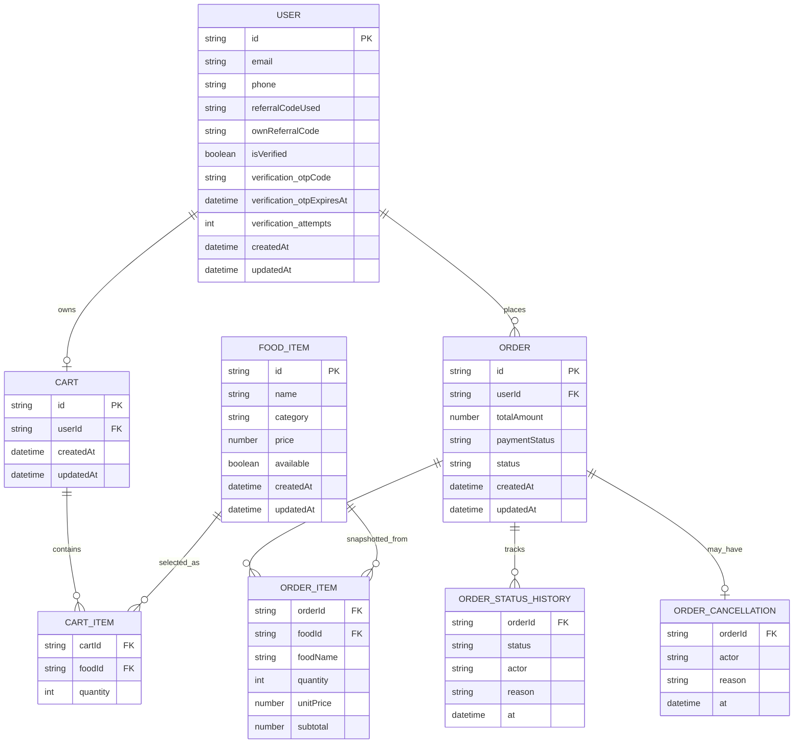

# Entity Relationship Diagram (ERD)

```mermaid
erDiagram
    USER ||--o| CART : owns
    USER ||--o{ ORDER : places
    CART ||--o{ CART_ITEM : contains
    FOOD_ITEM ||--o{ CART_ITEM : selected_as
    ORDER ||--o{ ORDER_ITEM : contains
    FOOD_ITEM ||--o{ ORDER_ITEM : snapshotted_from
    ORDER ||--o{ ORDER_STATUS_HISTORY : tracks
    ORDER ||--o| ORDER_CANCELLATION : may_have

    USER {
      string id PK
      string email
      string phone
      string referralCodeUsed
      string ownReferralCode
      boolean isVerified
      string verification_otpCode
      datetime verification_otpExpiresAt
      int verification_attempts
      datetime createdAt
      datetime updatedAt
    }

    FOOD_ITEM {
      string id PK
      string name
      string category
      number price
      boolean available
      datetime createdAt
      datetime updatedAt
    }

    CART {
      string id PK
      string userId FK
      datetime createdAt
      datetime updatedAt
    }

    CART_ITEM {
      string cartId FK
      string foodId FK
      int quantity
    }

    ORDER {
      string id PK
      string userId FK
      number totalAmount
      string paymentStatus
      string status
      datetime createdAt
      datetime updatedAt
    }

    ORDER_ITEM {
      string orderId FK
      string foodId FK
      string foodName
      int quantity
      number unitPrice
      number subtotal
    }

    ORDER_STATUS_HISTORY {
      string orderId FK
      string status
      string actor
      string reason
      datetime at
    }

    ORDER_CANCELLATION {
      string orderId FK
      string actor
      string reason
      datetime at
    }
```
