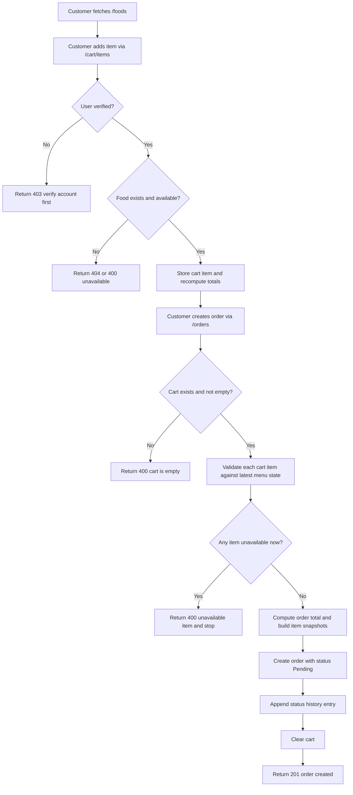

# Order Processing Flow

```mermaid
flowchart TD
    A[Customer fetches /foods] --> B[Customer adds item via /cart/items]
    B --> C{User verified?}
    C -- No --> C1[Return 403 verify account first]
    C -- Yes --> D{Food exists and available?}
    D -- No --> D1[Return 404 or 400 unavailable]
    D -- Yes --> E[Store cart item and recompute totals]
    E --> F[Customer creates order via /orders]

    F --> G{Cart exists and not empty?}
    G -- No --> G1[Return 400 cart is empty]
    G -- Yes --> H[Validate each cart item against latest menu state]
    H --> I{Any item unavailable now?}
    I -- Yes --> I1[Return 400 unavailable item and stop]
    I -- No --> J[Compute order total and build item snapshots]
    J --> K[Create order with status Pending]
    K --> L[Append status history entry]
    L --> M[Clear cart]
    M --> N[Return 201 order created]
```
