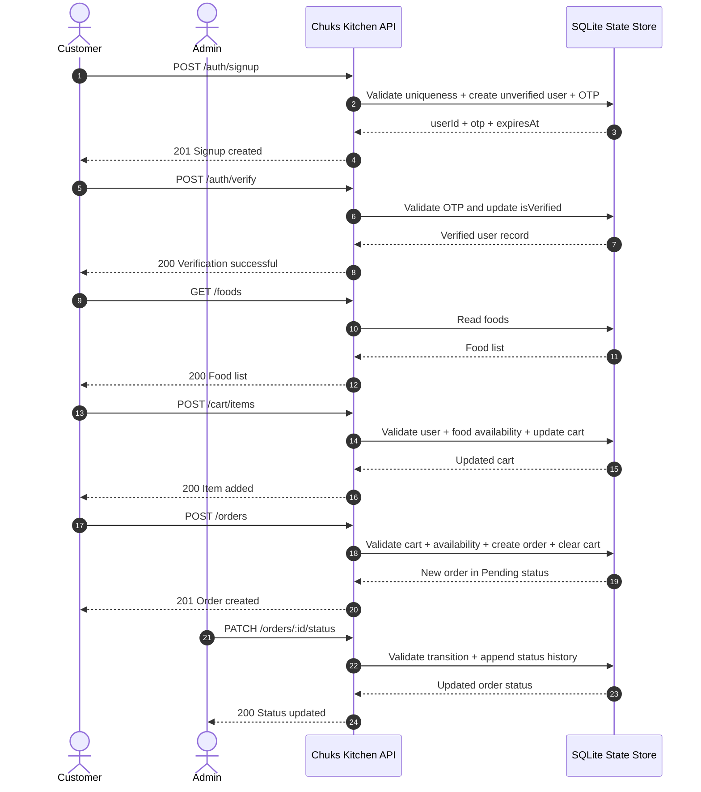

# System Sequence Diagram

```mermaid
sequenceDiagram
    autonumber
    actor Customer
    actor Admin
    participant API as Chuks Kitchen API
    participant DB as SQLite State Store

    Customer->>API: POST /auth/signup
    API->>DB: Validate uniqueness + create unverified user + OTP
    DB-->>API: userId + otp + expiresAt
    API-->>Customer: 201 Signup created

    Customer->>API: POST /auth/verify
    API->>DB: Validate OTP and update isVerified
    DB-->>API: Verified user record
    API-->>Customer: 200 Verification successful

    Customer->>API: GET /foods
    API->>DB: Read foods
    DB-->>API: Food list
    API-->>Customer: 200 Food list

    Customer->>API: POST /cart/items
    API->>DB: Validate user + food availability + update cart
    DB-->>API: Updated cart
    API-->>Customer: 200 Item added

    Customer->>API: POST /orders
    API->>DB: Validate cart + availability + create order + clear cart
    DB-->>API: New order in Pending status
    API-->>Customer: 201 Order created

    Admin->>API: PATCH /orders/:id/status
    API->>DB: Validate transition + append status history
    DB-->>API: Updated order status
    API-->>Admin: 200 Status updated
```
