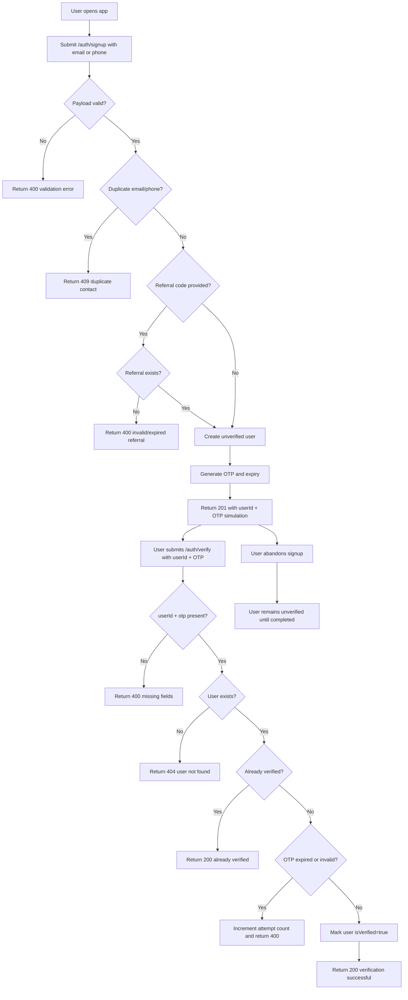

# User Registration and Access Flow

```mermaid
flowchart TD
    A[User opens app] --> B[Submit /auth/signup with email or phone]
    B --> C{Payload valid?}
    C -- No --> C1[Return 400 validation error]
    C -- Yes --> D{Duplicate email/phone?}
    D -- Yes --> D1[Return 409 duplicate contact]
    D -- No --> E{Referral code provided?}
    E -- Yes --> F{Referral exists?}
    F -- No --> F1[Return 400 invalid/expired referral]
    F -- Yes --> G[Create unverified user]
    E -- No --> G

    G --> H[Generate OTP and expiry]
    H --> I[Return 201 with userId + OTP simulation]

    I --> J[User submits /auth/verify with userId + OTP]
    J --> K{userId + otp present?}
    K -- No --> K1[Return 400 missing fields]
    K -- Yes --> L{User exists?}
    L -- No --> L1[Return 404 user not found]
    L -- Yes --> M{Already verified?}
    M -- Yes --> M1[Return 200 already verified]
    M -- No --> N{OTP expired or invalid?}
    N -- Yes --> N1[Increment attempt count and return 400]
    N -- No --> O[Mark user isVerified=true]
    O --> P[Return 200 verification successful]

    I --> Q[User abandons signup]
    Q --> Q1[User remains unverified until completed]
```
